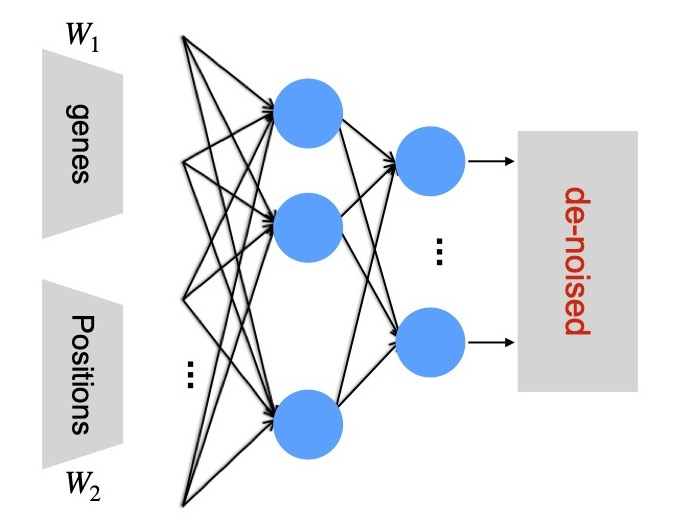

 <h2> SpaIm </h2> 

-------------------
**SpaIm** is a tool for de-noising gene expressions in the spatial transcriptomics (ST) data. All the copyrights are explained by Kenong Su <kenong.su@pennmedicine.upenn.edu> from [Dr. Li's lab](https://transgen.med.upenn.edu/).

### downsampling
Using Dirichlet Multinomial (DM) Mixture Models for simulation the downsampled gene expression data. The DM parameters are estimated by simple method of moments (MoM) approach. It includes two steps: draw from the Dirichlet distribution, and simulate multinomial distribution with a shrinked N. The example can be found here [DM_simulation](https://github.com/suke18/spaIm/blob/main/downsampling/DM_simulation.Rmd), and the breast cancer 10x Visium data can be found here [IDC](https://www.10xgenomics.com/resources/datasets/invasive-ductal-carcinoma-stained-with-fluorescent-cd-3-antibody-1-standard-1-2-0). The corresponding compiled `.h5ad` format data can be found at the [google drive](https://drive.google.com/drive/u/0/folders/1yiYOw2wL8-xunOkkVy-VkIh1h8mrUgjC).

### de-noising
Using NB decoder to de-noise the original gene expression matrix. The workflow includes two inputs followed by the negative bionomial decoder.

  

The tutorial for running spaIm can be found here. 
